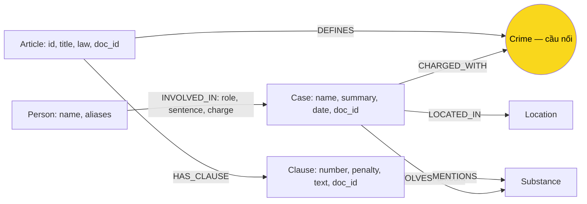

# Thiết kế Ontology — Day 19

**Họ tên:** Phạm Anh Minh  **MSSV:** 2A202603009

Thông tin người làm lấy theo tên thư mục bài lab.

**Lựa chọn:**
- [x] Dùng ontology gợi ý (có thể chỉnh nhỏ)
- [ ] Tự thiết kế (xét bonus +15)

Thiết kế được lập trước khi code và đối chiếu sau benchmark cuối: graph có 7 label và 7 relationship theo HINT trong `src/graph.py`; không yêu cầu bonus. Kết quả và hạn chế thực tế nằm trong REPORT_KG.md và GRAPH_EVIDENCE.json.

## 1. Sơ đồ

### Quan sát dữ liệu

Đã đọc `data/drug_law/blhs-dieu-251.md`, 6 câu trong `data/benchmark_kg.json` và 4 bài sau trong `data/drug_news/`:

| File | Thứ và quan hệ quan sát được |
| --- | --- |
| `news-100260917203001265.md` | Cái Quang Huy, Nguyễn Tiến Đạt tham gia vụ vận chuyển MDMA, Ketamine từ Đức qua Nội Bài; Huy chịu trách nhiệm hơn 9,6kg MDMA, Đạt gần 4,3kg. Nguyễn Hữu Đức được hủy quyết định khởi tố, không được tự gán là đồng phạm. |
| `news-100260918080821054.md` | Lê Minh Thành bị tuyên 36 tháng tù về mua bán; Kiên, Tuấn, Hưng mỗi người 24 tháng; chất MDMA được giám định, có ketamine; vụ ở Hà Nội, có thông tin sơ thẩm/phúc thẩm. |
| `news-100260920221957595.md` | Dương Minh Tuấn có biệt danh Hoàng Nato, bị bắt để điều tra tổ chức sử dụng; chuyên án tại TP.HCM gồm nhiều đường dây; có etomidate, ketamine, thuốc lắc; chưa có mức án của Hoàng Nato. |
| `news-100260928173914514.md` | Vụ hơn 36kg xét xử ngày 28-9 tại TP.HCM; Trần Thanh Tuấn, Trần Minh Tâm bị tuyên tử hình về mua bán; các người khác trong bài có mức án và tội danh khác. |

| Thứ/quan hệ | Luật | Tin | Có ở cả hai? | Mô hình hóa |
| --- | --- | --- | --- | --- |
| Tội danh | Điều định nghĩa tội | Vụ/người bị điều tra, truy tố, xét xử về tội | **Có** | `Crime`; `DEFINES`, `CHARGED_WITH` |
| Chất, ví dụ MDMA | Khoản liệt kê chất | Chất thu giữ/giám định | **Có, một phần** | `Substance`; `MENTIONS`, `INVOLVES` |
| Khối lượng, hình phạt | Ngưỡng, khung luật | Lượng thực tế, mức án | **Có về loại thông tin, khác ý nghĩa** | `Clause.text/penalty`, `INVOLVES.amount`, `INVOLVED_IN.sentence` |
| Điều, khoản, điểm | Cấu trúc văn bản luật | Có thể viện dẫn Điều, như Điều 16 trong bài Thành | **Có, nhưng tin không có đủ văn bản luật** | `Article`, `Clause`; điểm giữ trong text, chỉ dựng Điều từ KB luật |
| Người, biệt danh, vụ, địa điểm, ngày | Quy định chung, không định danh bị cáo | Thực thể cụ thể | Không ở mức thực thể cụ thể | `Person`, `Case`, `Location`; ngày/vai trò là property |
| Khái niệm tiền chất | Định nghĩa trong Luật PCMT | Không thấy trong 4 bài mẫu | Không trong mẫu đọc | Giữ trong `Clause.text` |

## 2. Entity types (node labels)

| Label | Ý nghĩa | Khóa định danh (`MERGE` theo) | Properties | Lấy từ KB nào | Trích bằng (regex / LLM / khác) |
| --- | --- | --- | --- | --- | --- |
| `Article` | Một Điều của một luật | `id`, ví dụ `Điều 251 BLHS` | `id, title, law, doc_id` | Luật | Metadata + `parse_law_article` |
| `Clause` | Khoản thuộc Điều | `id`, ví dụ `Điều 251 BLHS khoản 1` | `id, number, penalty, text, doc_id` | Luật | Regex `^(\d+)\.\s`; giữ toàn văn khoản |
| `Crime` | Tội danh chuẩn | `name` chuẩn từ luật | `name` | **Cả hai** | Tiêu đề luật + `normalize_crime`; tin: LLM + `link_entity` |
| `Substance` | Tên chất | `name` | `name` | **Cả hai** | Luật: dò danh sách bằng `find_substances`; tin: LLM |
| `Case` | Vụ việc | `name` do LLM đặt; dự phòng tiêu đề bài | `name, summary, date, doc_id, source_title` | Tin | LLM; nguồn từ metadata |
| `Person` | Người cụ thể | `name`, ưu tiên họ tên đầy đủ | `name, aliases` | Tin | LLM |
| `Location` | Địa điểm vụ | `name` | `name` | Tin | LLM |

Dùng `suggested_constraints()` tạo uniqueness constraint cho từng khóa rồi `MERGE`. Constraint ngăn trùng khóa, không bảo đảm hai cách viết của cùng thực thể được gộp. Không fuzzy-match tên người để tránh gộp nhầm; biệt danh nằm trong aliases, không làm khóa.

Article, Clause, Case có `doc_id = Document.id` để nối chunk vector với graph. Crime, Substance, Person, Location có thể dùng chung nhiều tài liệu, theo HINT không gán một doc_id đơn lẻ; truy nguồn qua cạnh tới Article/Clause/Case. Case trùng tên giữa nhiều bài có thể bị ghi đè doc_id: đây là hạn chế đã biết, không phải lưu nguồn đa tài liệu.

## 3. Relationships

| Type | Từ → Đến | Properties trên cạnh | Ý nghĩa |
| --- | --- | --- | --- |
| `INVOLVED_IN` | `Person → Case` | `role, sentence, charge` | Vai trò, mức án, tội danh riêng của người; không có thông tin giữ chuỗi rỗng |
| `CHARGED_WITH` | `Case → Crime` | Không | Tội/hành vi được nêu trong vụ; không mặc định mọi người mang mọi tội của vụ |
| `INVOLVES` | `Case → Substance` | `amount` (chuỗi gốc) | Chất và lượng ở cấp vụ; giữ đơn vị và từ hơn/gần |
| `LOCATED_IN` | `Case → Location` | Không | Vụ diễn ra ở địa điểm |
| `DEFINES` | `Article → Crime` | Không | Điều BLHS định nghĩa tội; Điều định nghĩa khái niệm không cần cạnh này |
| `HAS_CLAUSE` | `Article → Clause` | Không | Điều chứa khoản |
| `MENTIONS` | `Clause → Substance` | Không | Khoản nhắc chất, không khẳng định khoản tự động áp dụng |

Mức án đặt trên cạnh vì khác nhau theo người/vụ. Khi hỏi theo người phải kiểm tra `INVOLVED_IN.charge`. Không suy từ bị bắt sang đã bị kết án.

## 4. Node cầu nối giữa 2 KB

- **Node chính:** Crime, qua đường `Person → Case → Crime ← Article → Clause`.
- **Lý do:** tội danh có ở cả tin và luật, cho phép tìm Điều từ vụ. Substance là cầu phụ cho khoản/chất và Q6, nhưng cùng chất có thể liên quan nhiều tội nên không đủ xác định Điều.
- **Khớp tên:** lấy danh sách tội chuẩn từ tiêu đề luật, đưa vào prompt; `link_entity` chuẩn hóa cả hai phía, khớp chính xác trước rồi `difflib` cutoff 0.8, trả cách viết gốc trong danh sách. `normalize_crime` hiện hạ chữ, gộp khoảng trắng, bỏ tiền tố “tội”; biến thể tuý/túy phải kiểm tra qua khớp gần, không giả định hàm hiện tại đã đổi dấu.
- **Cầu gãy:** trích thiếu tội, tên quá khác, JSON sai hoặc tội ngoài KB luật. Không khớp trả None, không đoán. Kiểm tra Case thiếu CHARGED_WITH, đối chiếu bài theo doc_id, sửa prompt/chuẩn hóa rồi trích lại; ngoài phạm vi luật thì ghi thiếu dữ liệu.
- **Nối sai:** bài nhiều vụ/tội có thể gán tội người này cho người khác. Phải đối chiếu charge trên cạnh Person–Case, summary và nguồn; giữ đúng trạng thái bị điều tra/truy tố/tuyên án.

## 5. Competency questions

Pattern là kế hoạch truy xuất, chưa phải truy vấn đã chạy. Tên Case phải lấy từ graph thật. Không đưa gold benchmark vào graph.

| Câu | Đường đi (Cypher pattern) | Trả lời được? |
| --- | --- | --- |
| Q1 — tiền chất | `(a:Article)-[:HAS_CLAUSE]->(cl:Clause)`, chọn Điều 2 Luật PCMT 2021, khoản 4 từ `pcmt-dieu-2`; trả `cl.text`. Seed theo doc_id chunk luật. | Có từ text/chunk; không cần Crime. Phải lấy khoản 4, không chỉ khoản 1. |
| Q2 — ai tử hình vụ 36kg | `(p:Person)-[r:INVOLVED_IN]->(k:Case)-[:LOCATED_IN]->(:Location)`; chọn `k.doc_id = 'news-100260928173914514'`, đối chiếu ngày 28-9, TP.HCM, vụ hơn 36kg; lọc sentence chứa tử hình, trả DISTINCT tên. | Có nếu trích đủ: Trần Thanh Tuấn, Trần Minh Tâm. Không lấy mọi người trong vụ. |
| Q3 — Thành, mức án, luật | `(:Person {name:'Lê Minh Thành'})-[r:INVOLVED_IN]->(:Case)-[:CHARGED_WITH]->(c:Crime)<-[:DEFINES]-(a:Article)-[:HAS_CLAUSE]->(cl:Clause {number:1})`; kiểm `r.charge = c.name`. | Có: 36 tháng, mua bán, Điều 251, khung 02–07 năm theo dữ liệu lab. |
| Q4 — Hoàng Nato, phạt tối đa | `(p:Person)-[r:INVOLVED_IN]->(:Case)-[:CHARGED_WITH]->(c:Crime)<-[:DEFINES]-(a:Article)-[:HAS_CLAUSE]->(cl:Clause)`; chọn alias Hoàng Nato/tên Dương Minh Tuấn, đối chiếu tội tổ chức sử dụng, lấy mọi khoản Điều 255. | Có về dữ liệu lưu: khoản 4, 20 năm hoặc chung thân. Là khung luật, chưa phải mức án của Tuấn. Bộ lọc HINT khoản 1 + chất có thể bỏ khoản cao nhất; cần nhánh lấy toàn Điều. |
| Q5 — Huy, chất, lượng, khoản | `(:Person {name:'Cái Quang Huy'})-[:INVOLVED_IN]->(k:Case)-[v:INVOLVES]->(s:Substance)` và `(k)-[:CHARGED_WITH]->(:Crime)<-[:DEFINES]-(a:Article)-[:HAS_CLAUSE]->(cl:Clause)-[:MENTIONS]->(s)`; lấy amount và text các khoản MDMA. | Có nhờ LLM đối chiếu văn bản: hơn 9,6kg MDMA vượt 100g, khoản 4 Điều 250, 20 năm/chung thân/tử hình; Ketamine khoảng 406g. Chưa so sánh ngưỡng tự động bằng Cypher; lượng riêng từng người phải đối chiếu chunk. |
| Q6 — các vụ MDMA | `(k:Case)-[:INVOLVES]->(s:Substance)`, lọc tên chất không phân biệt hoa/thường; bổ sung `(p:Person)-[:INVOLVED_IN]->(k)`; lấy từng vụ, chất/amount, người, source_title, summary, doc_id trên toàn graph. | Có nếu nạp/trích đủ 20 bài: phải bao phủ vụ Huy, Thành, Viện Pháp y tâm thần Trung ương. Xuất danh sách riêng ghi rõ chất trên mỗi bản ghi; không tự gộp hai tên khác nhau của cùng vụ. |

Khi code context cần nhánh Q1 lấy khoản định nghĩa, Q4 lấy mọi khoản để xét tối đa, Q6 truy vấn toàn graph thay vì chỉ top-k seed. Q6 xuất danh sách riêng có chất và nguồn cho từng vụ, không mở rộng khoản luật không cần thiết; nếu vượt max_facts phải báo danh sách chưa đầy đủ. Q5 trả văn bản các khoản cho LLM đọc điều kiện; không tuyên bố graph tự tính khoản áp dụng.

## 6. Quyết định thiết kế và đánh đổi

1. **Crime làm cầu chính**, thay vì chỉ Substance/vector. Chất không xác định duy nhất tội; Crime dẫn tới đúng Điều. Đổi lại lỗi link tên có thể làm mất nhánh luật.
2. **Tách Article/Clause, giữ điểm trong text**, thay vì chỉ Article hoặc thêm Point/Threshold. Trả khung cơ bản Q3 dễ, ít node; đổi lại Q5 phải đọc điều kiện bằng LLM, prompt dài và chưa tính ngưỡng số.
3. **Mức án/tội riêng trên Person–Case**, thay vì trên Person hoặc node SentencingEvent. Phù hợp nhiều người/mức án trong Q2; đổi lại không lưu tách biệt lịch sử sơ thẩm/phúc thẩm.
4. **Khóa tên theo HINT + constraint**, thay vì Case.id theo sự kiện và Person.id hồ sơ. Triển khai gọn trong lab; chấp nhận trùng tên, biến thể tên và ghi đè nguồn. Constraint chỉ bảo đảm duy nhất khóa, không bảo đảm duy nhất thực thể ngoài đời.
5. **Regex luật, LLM tin**, thay vì LLM cả hai hoặc regex tin. Luật cấu trúc đều, regex rẻ và lặp lại được; tin văn xuôi cần hiểu vai trò/biệt danh. LLM tốn token và có thể trích sai/thiếu.
6. **Tên chất theo danh sách chuẩn, lượng giữ chuỗi**, thay vì từ điển đồng nghĩa và số gam chuẩn. Giữ hơn/gần và đơn vị gốc; đổi lại thuốc lắc chưa chắc được gộp MDMA, lượng chưa so sánh số trực tiếp. Không đổi tên chất khi nguồn chưa xác nhận.

## 7. So với ontology gợi ý (bắt buộc nếu xét bonus)

Không xét bonus. Các nhánh retrieval cho Q1/Q4/Q6 không phải ontology mới. Kết quả thực nghiệm và thay đổi retrieval Q6 được ghi trong REPORT_KG.md; cấu trúc ontology vẫn theo HINT.

| Điểm khác | Gợi ý làm gì | Bạn làm gì | Vấn đề nó giải quyết | Bằng chứng (Cypher, hoặc số liệu benchmark) |
| --- | --- | --- | --- | --- |
| Không đổi cấu trúc | 7 label, 7 relationship | Dùng HINT và ghi rõ giới hạn | Giữ tương thích helper khi triển khai | Benchmark cuối: 205 node/384 cạnh, 7 label; query kiểm loại cạnh được lưu cùng bằng chứng |

## 8. Hạn chế còn lại

- Case/Person khóa tên có thể trùng hoặc gộp nhầm. HINT có thể ghi đè Case.doc_id, summary, aliases và thuộc tính cạnh khi nhiều bài mô tả cùng thực thể.
- Bài Thành có đoạn giới thiệu vụ Huy cuối bài; bài Huy có đoạn về chủ quán bar F1. LLM có thể tạo vụ phụ/trùng hoặc gán sai thông tin. Cần đối chiếu nguồn, không coi mọi đoạn thuộc vụ chính.
- INVOLVES.amount ở cấp vụ không phân biệt lượng từng người/lần vận chuyển. Q5 cần phân biệt hơn 9,6kg của Huy với gần 4,3kg của Đạt bằng bài gốc.
- Chưa có ngưỡng số, đơn vị chuẩn và điều kiện tăng nặng. MENTIONS không đủ xác định khoản áp dụng.
- Chưa tách sự kiện tố tụng; cần nguồn và role/summary để tránh coi bị điều tra là đã bị kết án.
- Chưa có cơ chế gộp đồng nghĩa chất chắc chắn; danh sách HINT chưa chứa etomidate. Không ép chất ngoài danh sách thành chất khác.
- Q6 có thể thiếu vì trích xuất, vụ trùng, giới hạn facts hoặc chỉ mở rộng top-k.
- Article.id chưa phân biệt phiên bản luật. Chỉ dùng corpus cố định của lab, không khẳng định văn bản hiện hành.
- Sau KG-2 phải kiểm label, relationship, doc_id, cầu nối và Q1–Q6; cập nhật thiết kế nếu code thay đổi.
